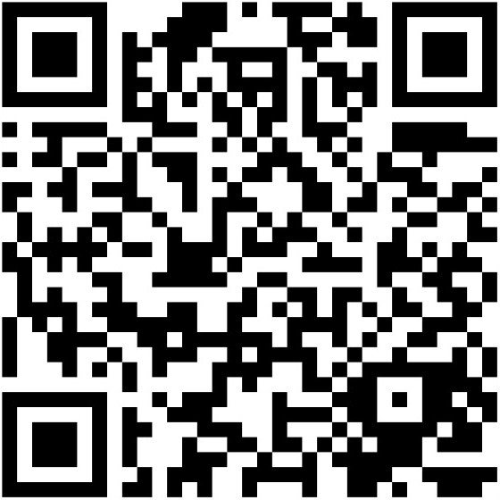
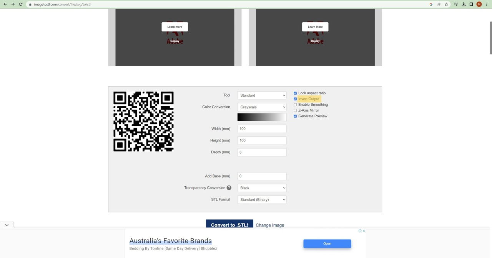
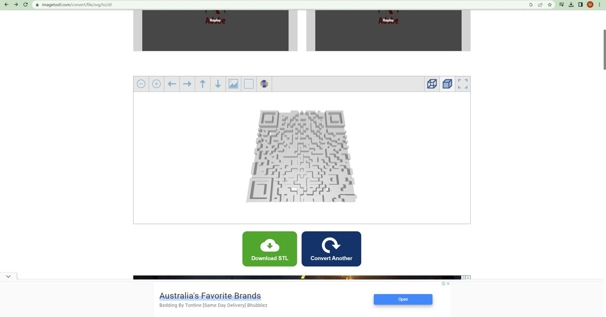
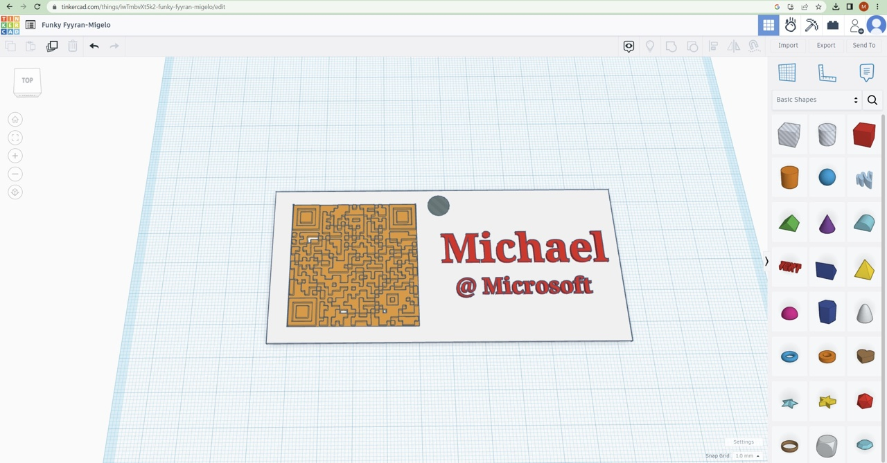
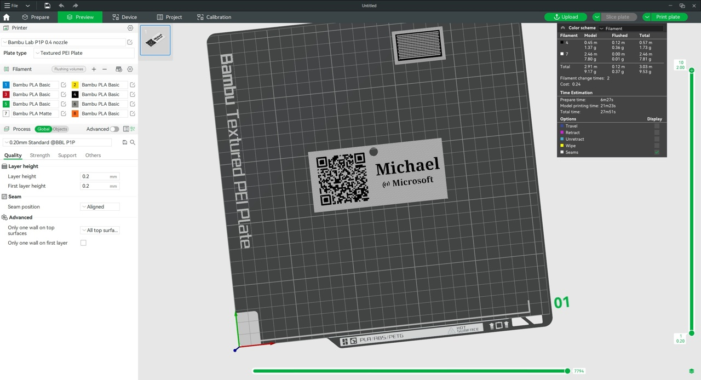
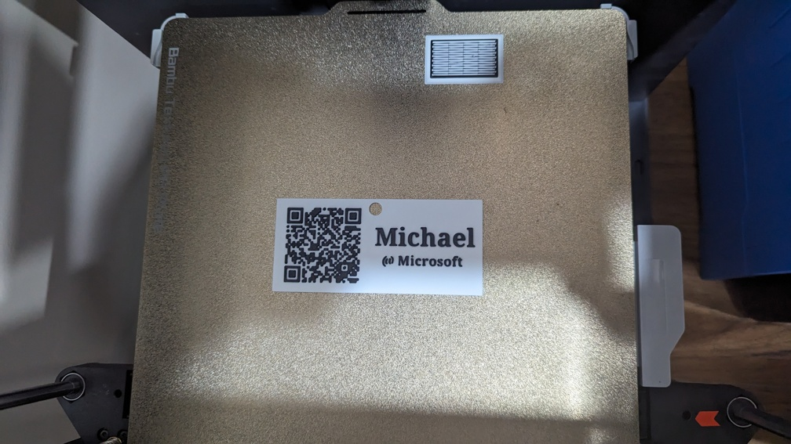

I've been toying with the idea of making a custom event badge for a while now, and I finally got around to it!

The reason being is that I love connecting with people, but I hate constantly getting my phone out of my pocket to show my Linkedin QR code. So I thought it would be cool to have a badge with a QR code on it that people could scan, get my details and connect on Linkedin 😎

### TLDR

* Take a screenshot of your LinkedIn QR code.
* Convert it to a SVG image. I used [Adobe jpg-to-svg](https://www.adobe.com/express/feature/image/convert/jpg-to-svg).
* Convert the SVG to a STL file. I used [imagetostl](https://imagetostl.com/convert/file/svg/to/stl).
* Make the event badge using 3d modelling software. I used [Tinkercad](https://www.tinkercad.com/)
* Print STL to physical object 🍾

>❗The last step requires a 3d printer.

### Getting your LinkedIn QR code

This process wasn't too difficult, but it was a bit of a pain. I'm sure there's a better way to do it, but this is what I did.

1. Open the Linkedin app on your phone.
2. Click on the search bar on the top of the screen.
3. Click on the QR code icon in the top right corner.
4. Screenshot the QR code.
5. Email the screenshot to yourself.
6. Crop the QR code out of the screenshot. like below:

### Converting the QR code to a SVG

I used [Adobe jpg-to-svg](https://www.adobe.com/express/feature/image/convert/jpg-to-svg) to convert the QR code to a SVG image. It's a free online tool that does the job well. Not too much to see about this process, just upload the image and download the SVG.

### Converting the SVG to a STL

I used [imagetostl](https://imagetostl.com/convert/file/svg/to/stl) to convert the SVG to a STL file. It's a free online tool that does the job well.

The reason we are converting this file into a STL, is so I can import it into [Tinkercad](https://www.tinkercad.com/) to create the badge. If you are using another 3d modelling tool that can import SVG files, you can skip this step.

* Go to [imagetostl](https://imagetostl.com/convert/file/svg/to/stl)
* Upload your SVG file
* Select **Invert Output** like below and convert

* Your outpt put should look like the below image. Download the STL file.

### Making the badge

I used [Tinkercad](https://www.tinkercad.com/) to make the badge. I find Tinkercad to be the easiest 3d modelling tool to use, but you can use whatever you like. I have tried other (Blender, Fusion 360, etc) but I find them to be too complicated for my needs.

* Open Tinkercad and create a flat card to put your QR code on. I made mine 110mm x 50mm x 1mm.

>💡Tip: 1mm is too thin. It bends too much and I feel like it could break. Next time I will make it 2mm thick.

* I also added a hole to the top so I could attach a lanyard to it.

* Next I imported my QR Code and place it on the card. I also made it 1mm thick.

* Also I added my first name and company to the right of the card. I used the default font and made it 1mm high.

* Lastly I downloaded the STL file to my PC.

### Printing the badge

>💡Tip: The printing process will vary depending on what 3d printer you have. I have a Bambu Lab P1P and the Bambu Lab AMS, which means I can print in multiple colours. I printed the card in white and the QR code and lettering in black.

* Open the downloaded STL in Bambu Studio.

* Add the desired colours to the STL.

* Print the STL using defaults.

and 27 minutes later, you have your event badge!

### Conclusion

I'm really happy with how the badge turned out. I've already used it at a few events and it's been a great conversation starter. I've also had a few people ask me how I made it, so I thought I would write this blog post to share the process.

I hope you found this post useful. If you have any questions, feel free to reach out to me on [Twitter](https://twitter.com/fredderf204) or [Linkedin](https://www.linkedin.com/in/1michaelfriedrich/).