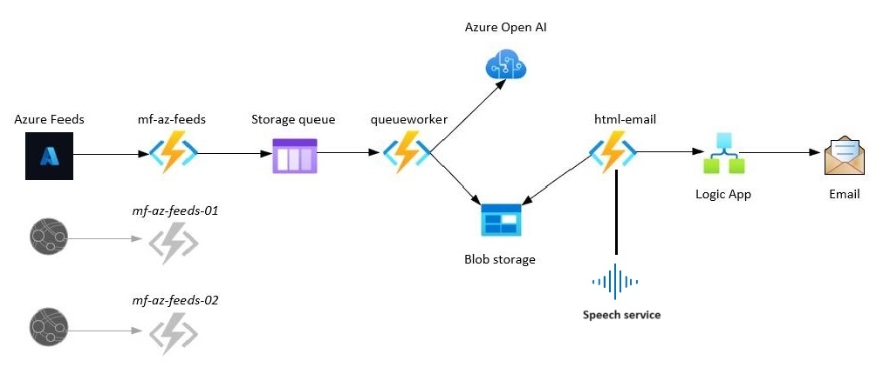
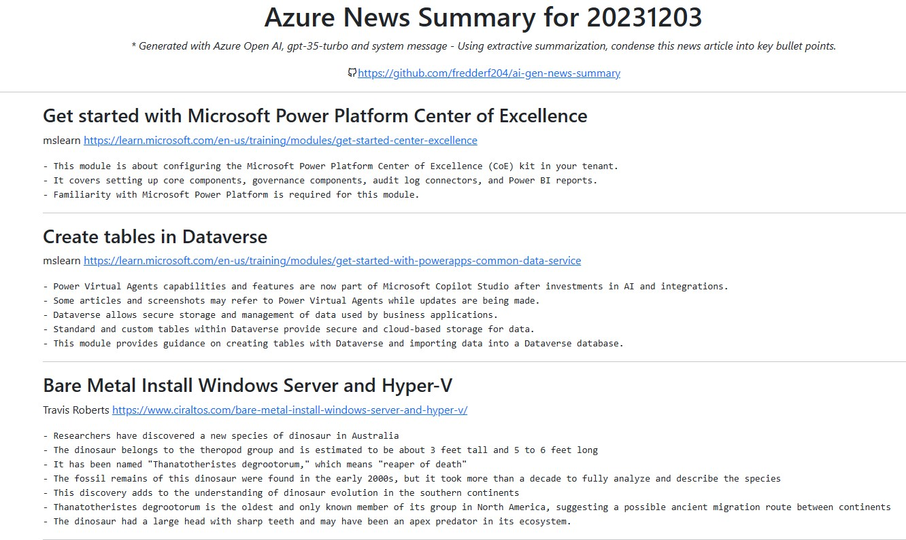
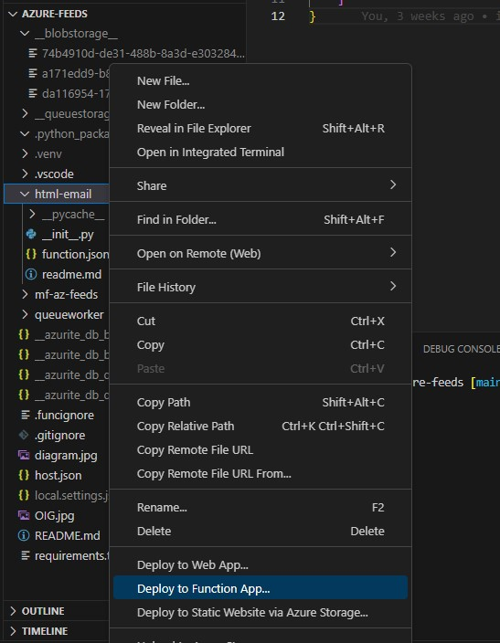
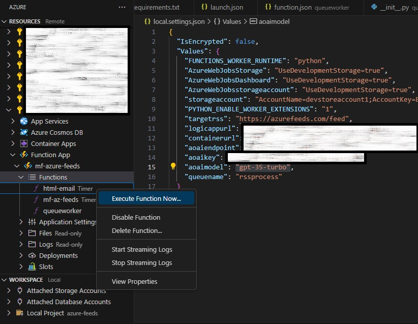

Are you trying to keep up with all of the daily Azure news? Are you finding it difficult and overwhelming? Well, I do 😭 but I have a solution for you 😎 I've created an Azure Function centred process that takes news articles from places like [Azure Feeds](https://azurefeeds.com/) and creates a summary of them using [Azure Open AI](https://azure.microsoft.com/en-us/products/ai-services/openai-service).

## TLDR

- [GitHub Repo](https://github.com/fredderf204/ai-gen-news-summary)
- Why I created this
- How it works
- How to use it
- What's next

## GitHub Repo

The code for this project can be found [here](https://github.com/fredderf204/ai-gen-news-summary). Feel free to fork it and make it your own. Or if you have any issues with the code or have any suggestions, please raise an issue ✊

## Why I created this

I created this project for a few reasons:

1. I find it very difficult to keep up with all of the Azure news. There is so much of it and it's coming from so many different places. I wanted to create a way to summarise all of the news into one place.
2. I wanted a baseline of what has happened in the Azure world over the last 24 hours, but I wanted a system where if I saw something that was interesting, I could go and read the full article.
3. I wanted a use case to build something with [Azure Open AI](https://azure.microsoft.com/en-us/products/ai-services/openai-service). I find this is the best way for me to learn something new.

## How it works



1. I have an Azure Function that runs every 24 hours on a timer trigger called mf-az-feeds. It gets the latest news articles from [Azure Feeds](https://azurefeeds.com/) using RSS and sends a JSON message to an Azure storage queue. The JSON contains fields like; title, description, link, and published date.

* Huge shout out to [Azure Feeds](https://azurefeeds.com/) as it's the place I have been getting my Azure news daily for many years!
* This process could be scaled to get news from other sources as diagramed, but I haven't done that yet.

2. The queueworker Azure Function reads each JSON message of the storage queue (queue trigger) and then uses [Azure Open AI](https://azure.microsoft.com/en-us/products/ai-services/openai-service) to create a summary of each article. Then the summary is combined with the JSON contains fields of title, description, link, and published date and stored in BLOB storage as JSON.

* I choose this process because I wanted a copy of the JSON and BLOB storage is cheap!
* Each day has it's own container and each article has it's own JSON file.

3. The html-email function has a time trigger that run every 24 hours (and 20 minutes after the mf-az-feeds function) and gets the JSON from BLOB storage and creates a HTML file. I store a copy of the html file in the days storage container and a copy in to the static website folder ($web) in Azure Storage. Then the function sends a REST request to my Logic App with the static website folder url, which in turn gets emailed to me. 

* I haven't documented the static website folder ($web) copy in the above diagram, but it's there. And so I can go the same URL each day, and it will be up to date with a AI generated summary of the Azure news for that day.

For example, this is what today's webpage looks like;



## How to use it

### Prerequisites

- Azure subscription
- Azure Function App
  - Add the below Function App Configuration Application settings once known.
    - "targetrss": "",
    - "logicappurl": "",
    - "containerurl": "",
    - "storageaccount": "", <---this is the connection string of your storage account.
    - "aoaiendpoint": "",
    - "aoaikey": "",
    - "aoaimodel": "",
    - "queuename": "rssprocess"
    - "staticurl": "" <---this is the static website URL of your storage account.
- Azure Storage Account
  - Blob Storage Container (remember the url path to this container.
  - Static website hosting enabled (remember this URL)
  - SAS Key (remember the key)
  - Queue with name rssprocess (this is hardcoded in the queueworker function.json)
- Azure Open AI resource (remember the endpoint name, key and model name.)
- Azure Logic App (remember the URL)

### Deploy the Azure Function App

Below are the steps to deploy the Azure Function App to your Azure subscription from your local machine. I know this is the best way to do this, but I haven't had time to create an ARM template yet. If you want to create an ARM template, please raise a PR ✊

1. Clone the repo
2. Open the repo in VS Code
3. Make a Python virtual environment
4. Install the requirements.txt
5. Create a local.settings.json file and add the below settings. (This step isn't required if you are deploying to Azure, but if you ever want to debug it locally, it will be.)

```json
{
  "IsEncrypted": false,
  "Values": {
    "AzureWebJobsStorage": "",
    "FUNCTIONS_WORKER_RUNTIME": "python",
    "targetrss": "",
    "logicappurl": "",
    "containerurl": "",
    "storageaccount": "",
    "aoaiendpoint": "",
    "aoaikey": "",
    "aoaimodel": "",
    "queuename": "rssprocess",
    "staticurl": ""
  }
}
```

6. Deploy the Azure Function App to your Azure subscription using the Azure Functions extension in VS Code.



>💡Tip: I also like to have the function locally because I can then use the Azure extension in VS Code to run the function in Azure. In case something is wrong or borken and it needs a manual trigger.



## What's next

I have a few ideas on what I want to do next with this project. I'm not sure which one I will do first, but I will do them all eventually. Add a comment below if you have any suggestions or want to help out ✊