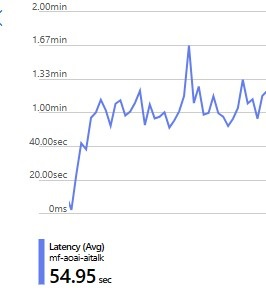

> I am a Microsoft employee, but the views expressed here are mine and not those of my employer.

I have been working with some clients that are new to Azure Open AI and they have been asking me about how to increase performance and reduce per call latency within the service. Usually I would talk them through [this](https://learn.microsoft.com/en-us/azure/ai-services/openai/how-to/latency) Microsoft article. But I thought I would go one step further with this article and use Python and test calls demonstrate the performance and latency of Azure Open AI.

## TLDR

If the performance and per call latency in Azure Open AI is not meeting you expectations, then make these changes, if possible in this order

- If you are creating a Chat bot or chat experience, enable stream mode in the call.
- Use the latest models in the [GPT-3.5 Turbo model series](https://learn.microsoft.com/en-us/azure/ai-services/openai/concepts/models#gpt-35-models).
- Reduce the amount of completion tokens in the model response.
- Use the max_tokens and stop parameters in the call.

## Streaming

The below is taken from [https://learn.microsoft.com/en-us/azure/ai-services/openai/how-to/latency#streaming](https://learn.microsoft.com/en-us/azure/ai-services/openai/how-to/latency#streaming);

"Setting ```stream: true``` in a request makes the service return tokens as soon as they're available, instead of waiting for the full sequence of tokens to be generated. It doesn't change the time to get all the tokens, but it reduces the time for first response. This approach provides a better user experience since end-users can read the response as it is generated."

I didn't think there was a need to test this. As I think the premise is sound and there are lots of examples where this provides a great user experience. I.e. ChatGPT.

## Testing setup

The other 3 items in the TLDR we are going to test.

We will be completing all of the test against Azure Open AI completions endpoint. All of the test were conducted with the following;

1. All tests were run on a VM deployed into the Australia East region.
2. The Azure Open AI service was deployed to the Australia East region.
3. The code that was used to create the tests can be found [here](https://github.com/fredderf204/aoai-tester).
4. The Python code was run as part of a cronjob on the VM. I modified the crontab file and add a new line like this; ``` * * * * * /usr/bin/python3 /home/fredderf204/aoai-tester/app.py >> /home/fredderf204/aoai-tester/aoai-tester.log 2>&1```. This means that the test will run every 1 minute and the output (both STDOUT and STDERR) will be written to a log file.
5. I collected the data from the log file and put it into a spreadsheet.

## Another way to monitor per call latency

I will be writing the results of my python code to a log file on the VM. I did this because I thought it would be a good way to record and measure the results.

But there is another way to monitor per call latency, and it's with Azure Monitor. [This](https://learn.microsoft.com/en-us/azure/ai-services/openai/how-to/monitoring) article goes into detail about how to do this. And the TLDR is that you can simply run your code against Azure Open AI and see the per call latency by clicking "Metrics" in the Azure Portal under the Monitoring section. Then select the latency metric and you will see something like this;



You can further filter by deployment, or api version, or endpoint. But to be honest, the only reason I didn't do this was because I didn't know how to get the data into excel to create the graphs. But I am sure there is a way.

## Test 1 - Use the latest models in the GPT-3.5 Turbo model series

The first test will be a per call latency test comparing GPT-4 vs GPT-3.5 Turbo. The general advice I give to my clients is the try GPT-3.5 Turbo model series to see if it meets your needs. If it does not, there try out GPT-4 model series. You will see below that GPT-3.5 Turbo is more performant and has a lower per call latency compared to GPT-4. But GPT-4 is more accurate, so it's a trade off.

In the below chart I sent 20 requests to each model and recorded the results. As mentioned previously, I used the code in this repo [here](https://github.com/fredderf204/aoai-tester) and used this prompt ```write a 500 word short story```. I chose this prompt for 2 reasons;

1. It's simple
2. It's going to create a fairly large amount completion tokens.


GPT-4 had an average end to end latency of 53.13 seconds and generated an average of 687.55 completion tokens per call.

GPT-3.5 Turbo had an average end to end latency of 7.77 seconds and generated an average of 756.9 completion tokens per call.

> As you can see GPT-3.5 Turbo is an order of magnitude faster than GPT-4. If you can switch from GPT-4 to GPT-3.5 Turbo, then you will see a quite an improvement in performance and per call latency. Which is why this is the first recommendation I make to my clients.

## Test 2 - Reduce the amount of completion tokens in the model response

For this test, we will take the previous results from GPT-4 and the prompt ```write a 500 word short story``` and compare it to the same model but use a modified prompt ```write a 300 word short story```. The only difference between the 2 prompts is the number of words in the story. Which should result in fewer completion tokens being generated.

Again we sent 20 calls to the service and recorded the results.


Prompt 1 (500 word short story) resulted in an average end to end latency of 53.13 seconds and generated an average of 687.55 completion tokens per call.

Prompt 2 (300 word short story) resulted in an average end to end latency of 25.33 seconds and generated an average of 434.05 completion tokens per call.

> As you can see, there is a direct correlation between the amount of completion tokens and the end to end latency. The more completion tokens, the longer the end to end latency. So if you can reduce the amount of completion tokens, you will see a reduction in end to end latency.

[This](https://learn.microsoft.com/en-us/azure/ai-services/openai/how-to/latency#generation-size-and-max-tokens) article goes into more detail about why this is.

## Test 3 - Use the max_tokens and stop parameters

For this test, one set of requests will have the max_tokens and stop parameters set and the other will not. We will use a new prompt which is larger and uses 2 shot examples. Both prompts were run against GPT-4. Please see the prompt below;

```write a 300 word story that begins with Once upon a time and ends with The End \n\nExample 1: Once upon a time, in a faraway land, there lived a young girl named Lila. She was a curious and adventurous girl who loved to explore the world around her. One day, while wandering through the woods, she stumbled upon a hidden cave. The entrance was small, but Lila was determined to explore it. She squeezed through the narrow opening and found herself in a large cavern. The walls were covered in glittering crystals that sparkled in the dim light. Lila was amazed by the beauty of the cave and decided to explore further.\n\nAs she walked deeper into the cave, she noticed a faint glow in the distance. She followed the light and soon found herself in a large chamber. In the center of the room was a glowing orb that pulsed with a soft light. Lila approached the orb and reached out to touch it. Suddenly, she was enveloped in a bright light and felt herself being lifted off the ground.\n\nWhen the light faded, Lila found herself in a strange new world. The sky was a deep shade of purple, and the trees were made of crystal. She looked around in wonder and realized that she had been transported to a magical realm.\n\nLila spent many years exploring this new world, meeting strange creatures and having incredible adventures. But eventually, she grew homesick and decided to return to her own world. She approached the glowing orb once again and was enveloped in a bright light. When the light faded, she found herself back in the cave where she had started.\n\nLila emerged from the cave, changed forever by her incredible journey. She went on to live a long and happy life, but she never forgot the magic of that other world. And so, we come to the end of our story. The End.\n\nExample 2: Once upon a time, in the kingdom of Uriel, lived an old shoemaker named Bartolo. He was a quiet man who lived a simple life, crafting the most beautiful shoes to earn his livelihood. But Bartolo had a secret - he could weave magic into his shoes, giving them abilities far beyond any regular footwear. And so, Uriel\'s inhabitants adored his creations, no one knowing Bartolo was actually a wizard in disguise.\n\nOne gloomy evening, Bartolo noticed a young girl sobbing outside his shop. Her cloth shoes were ripped and worn, her feet bloodied from the rough city cobblestones. Bartolo\'s heart squeezed at the sight. He called out to her, promising a pair of new shoes.\n\nThe next day, Bartolo presented the girl, Lily, with enchanted dancing shoes. They would protect her feet and lead her heart to happiness. She looked up at Bartolo, her eyes wet with gratitude, and danced away, leaving a trail of soft laughter and twinkling sparkles.\n\nWeeks later, a royal proclamation announced a grand ball to choose a prince\'s bride, and Lily decided to attend. That night, her gifted shoes guided her as she danced with a grace that awoke an otherworldly charm. The prince was instantly smitten by Lily\'s uniqueness and chose her as his bride.\n\nOn their wedding, Bartolo presented a wondrous pair of shoes to Lily as a wedding gift - shoes embedded with everlasting love and compassion. Witnessing Lily\'s happiness, Bartolo felt his life had been worthwhile. He had used his magic to give joy, and in return, he was filled with contentment.\n\nYears later, after living a fulfilled magical life, Bartolo passed away. But through Lily, his magical shoes, and the little happiness they brought to this kingdom, his legacy lived on, forever woven into the fabric of Uriel\'s tales. Thus, our story concludes, until we meet again under the moonlit pages of another tale. The End.```

For the second set of calls, we will set the max_token parameter to 450 and stop to ```The End```. This means that the model will stop generating tokens 3 ways;

1. When it finishes generating the response
2. When it hits the stop sequence of ```The End```.
3. When it reaches 450 tokens completion tokens.

This should result in fewer completion tokens being generated.


Call set 1 (no max_tokens or stop) resulted in an average end to end latency of 38.48 seconds and generated an average of 438.35 completion tokens per call.

Call set 2 (max_tokens = 450 and stop = The End) resulted in an average end to end latency of 34.55 seconds and generated an average of 426.8 completion tokens per call.

> I know it a little hard to tell in the chart, but there was a slight improvement in end to end latency and a slight reduction in the amount of completion tokens. This is why I would recommend this as the last thing to try. As it's not going to have a huge impact on performance or per call latency in comparison to the other 2 items above.

## Large prompt tokens have little impact on performance and per call latency

Going into this experiment, I though the amount of prompt tokens would have a large impact on performance and per call latency. Turns out that is not the case! I did 1 final test. Against GPT-4 I used our original prompt of ```write a 500 word short story``` and ran a test set. Then I used another prompt that started out the same, and I added a random set of 5000 words to the end of the prompt.

This resulted in first prompt having 14 prompt tokens and the second prompt having on average 7091 prompt tokens. I ran 20 calls against each prompt and recorded the results.


Call set 1 (14 prompt tokens) resulted in an average end to end latency of 53.13 seconds and generated an average of 687.55 completion tokens per call. I used the same data as the latest models test.

Call set 2 (7091 prompt tokens) resulted in an average end to end latency of 53.47 seconds and generated an average of 813.1 completion tokens per call. 

> There seems to be almost no difference in performance or per call latency when using a large amount of prompt tokens. So if you need to use a large amount of prompt tokens, then you should be ok.

## Conclusion

I would reccomend everyone go and read [https://learn.microsoft.com/en-us/azure/ai-services/openai/how-to/latency](https://learn.microsoft.com/en-us/azure/ai-services/openai/how-to/latency) as it has some great information about how to increase performance and reduce per call latency in Azure Open AI. Which we have just proved with Python in our simple experiments.
