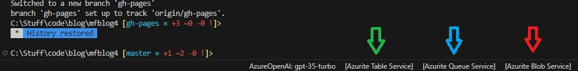
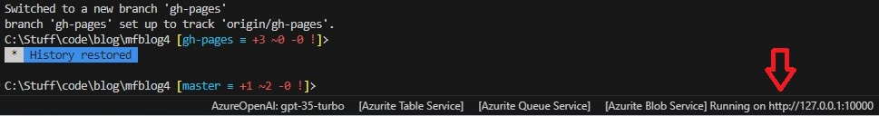
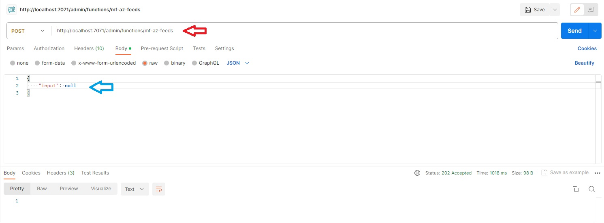
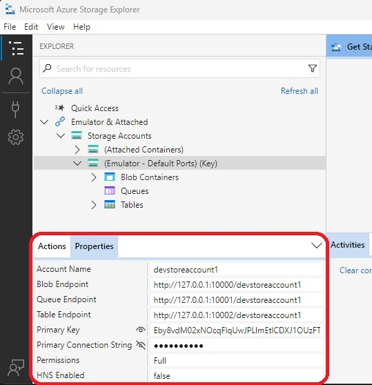
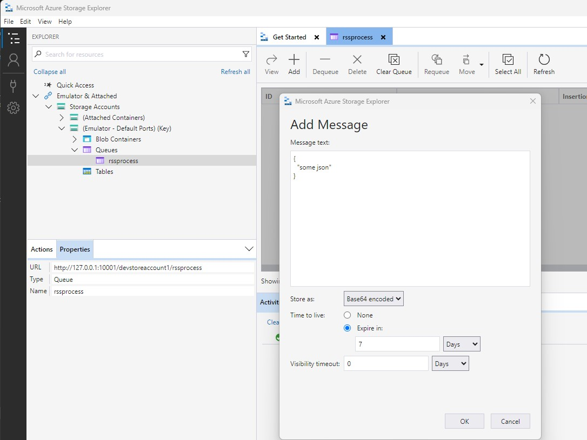

Running Azure Functions locally isn't something new, but it's being a while since I've done it and I thought I'd share my experiences with some of the new tools, using Python and triggering local functions using time and queue triggers.

## TLDR

* Use Visual Studio Code
* Install the Azure Functions extension
* Install the Azure Functions Core Tools
* Install the Azurite
* Install the Azure Storage Explorer

## VS Code

If you are developing Azure functions locally, I couldn't recommend [Visual Studio Code](https://code.visualstudio.com/) enough. It's a great editor and has a lot of great extensions that make developing Azure Functions locally a breeze. Also it's free and available on your favourite platform - Linux, macOS, and Windows.

## Developing Functions locally

There is already a great article [here](https://learn.microsoft.com/en-us/azure/azure-functions/functions-develop-vs-code?tabs=node-v3%2Cpython-v2%2Cisolated-process&pivots=programming-language-python) on how to develop Azure Functions by using Visual Studio Code.

The Azure Functions extension provides these benefits:

* Edit, build, and run functions on your local development computer.
* Publish your Azure Functions project directly to Azure.
* Write your functions in various languages while taking advantage of the benefits of Visual Studio Code.

> 💎 But to develop Azure Functions locally, you must install the [Azure Functions Core Tools](https://learn.microsoft.com/en-us/azure/azure-functions/functions-run-local) which enables an integrated local debugging experience. When using the Azure Functions extension, the easiest way to install Core Tools is by running the ``Azure Functions: Install or Update Azure Functions Core Tools`` command from the command pallet.

## Python

There isn't anything in particular you need to do make Python work with Azure Functions, but I couldn't recommend enough creating a virtual environment and using the same Python version that Azure Functions use in Azure. This will help with any issues you may have with dependencies once you deploy your Function to Azure. 

## Local debugging

I can't believe that I wasn't doing this from the start. The first few times I would right my Azure Function locally, deploy it to Azure and wait and see if it worked.

> 💎 This is a terrible idea and slowed down my development significantly. Once I started to debug locally, I was able to do so much more in a shorter amount of time.

## What the heck is Azurite?

Have you ever wanted to run and debug your function locally, but your Azure Function needs to interact with Azure Storage?

[Azurite](https://learn.microsoft.com/en-us/azure/storage/common/storage-use-azurite?tabs=visual-studio) is a great tool that provides a local Azure Storage emulator that emulates the Azure Blob, Queue, and Table services for local development purposes. It is the best way to test your Azure Storage code without going to Azure.

For instance, one of my Azure Functions had to write to Azure Blob storage. Azurite come in super handy as it can emulate Azure Blob storage locally. But what I did notice was that Azurite would validate my request to Azure Blob storage, but would not actually create the container and Blob object. But for me, having the request validated is good enough for development.

Also starting the Azurite emulator is super easy. Once install via a VSCode extension, look at the bottom of VSCode and you should see some button that look like this

You simply click on one of those services to start them up.

Speaking of development, Azurite can be run as a docker container, so I can imagine how that could be automated and added to a CI/CD pipeline. This way you can test your app in a pipeline before deploying to Azure, speeding up development ans shortening the dev cycle.

## How to trigger functions locally

Next challenge I faced was how to do trigger these functions locally? One function was setup on a time trigger to run once per day, and the other had a Azure queue trigger.

### Time trigger

I struggled to find the answer to this on 😞 but buried deep in the comments in this [thread](https://stackoverflow.com/questions/46556621/what-is-the-simplest-way-to-run-a-timer-triggered-azure-function-locally-once) I found the answer. 

> 💎 You have to send a POST request to the local admin endpoint ``http://localhost:{port}/admin/functions/{function_name}`` with ``Content-Type = application/json`` and body of ``{ "input": null }``

As you can see above I used Postman to send a POST request to the local admin endpoint of ``http://localhost:7071/admin/functions/mf-az-feeds``. Also please not that ``{ "input": null }`` was the only body data that triggered the function. If I sent any other value for the input, the function would not trigger.

### Queue trigger

This was slightly simpler, but requires 3 pre-reqs

* Installing [Azure Storage Explorer](https://azure.microsoft.com/en-us/products/storage/storage-explorer/).
* Starting up the Azurite queue service in Visual Studio Code.
* The local.settings.json file on your Function project needs to have the following well-known account and key ``"storageaccount": "AccountName=devstoreaccount1;AccountKey=Eby8vdM02xNOcqFlqUwJPLlmEtlCDXJ1OUzFT50uSRZ6IFsuFq2UVErCz4I6tq/K1SZFPTOtr/KBHBeksoGMGw==;DefaultEndpointsProtocol=http;BlobEndpoint=http://127.0.0.1:10000/devstoreaccount1;QueueEndpoint=http://127.0.0.1:10001/devstoreaccount1;TableEndpoint=http://127.0.0.1:10002/devstoreaccount1;",``

Then I used the Azure Storage Explorer to connect to the local Azurite queue service and crate a new queue with the same name as my queue trigger. Next I dropped a message in that queue, which triggered the function.

## Conclusion

I hope this helps you with your local Azure Function development. I know it helped me and I'm sure I'll be using these tools again in the future.

I hope you found this post useful. If you have any questions, feel free to reach out to me on [Twitter](https://twitter.com/fredderf204) or [Linkedin](https://www.linkedin.com/in/1michaelfriedrich/).