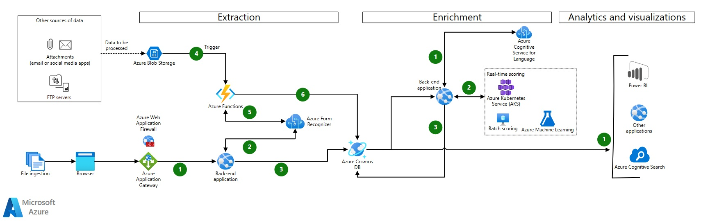
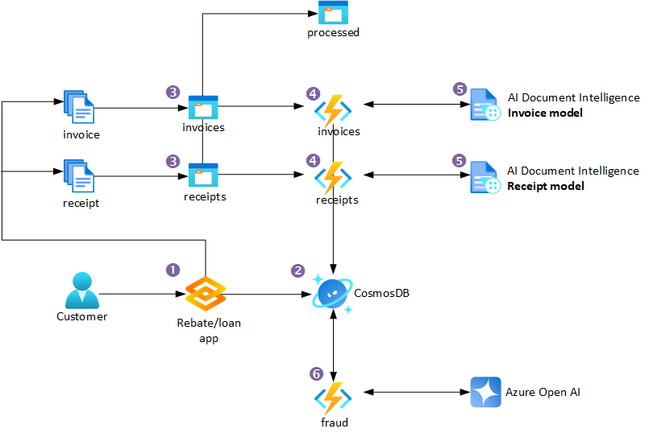
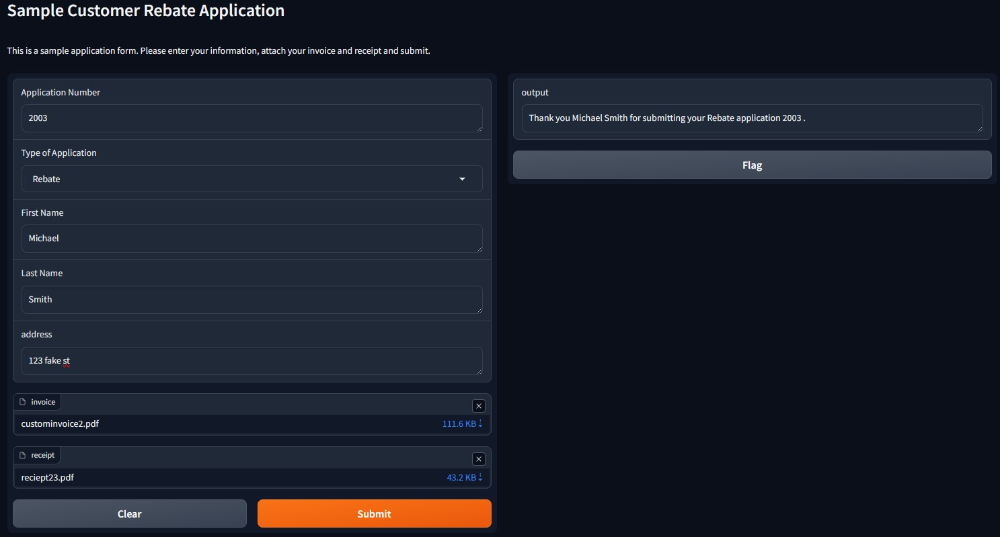
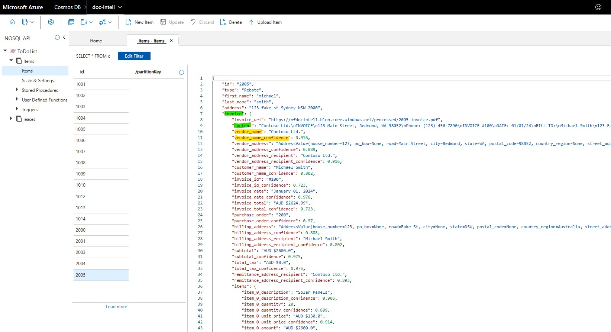
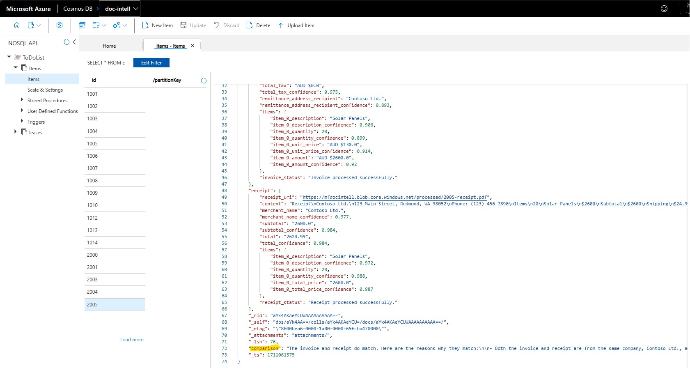
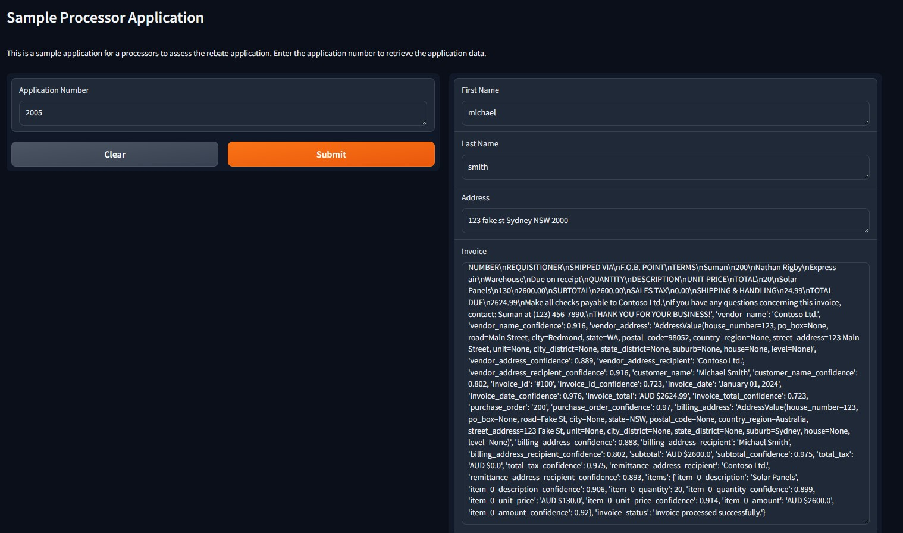
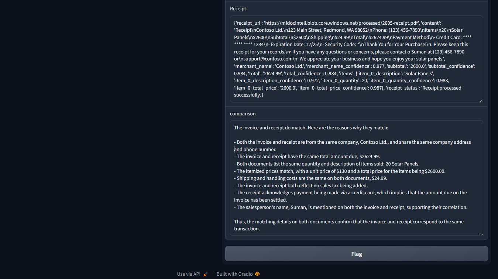

> I am a Microsoft employee, but the views expressed here are mine and not those of my employer.

I have been working with some clients recently on projects to automate the processing of financial documents. The goal is to extract key information from these documents and then use that information to perform some analysis. The analysis could be anything from fraud detection, risk assessment, summarization, classification, etc.

The idea behind this post is to show you how to build a simple document processing pipeline using Azure AI Document Intelligence and Azure Open AI. We will use Azure Document Intelligence to extract key information from the documents and then use Azure Open AI to perform fraud detection on the extracted information.

## TLDR

- Microsoft already has a defined architecture for automating document processing by using Azure AI Document Intelligence here - [Automate document processing by using Azure Form Recognizer](https://learn.microsoft.com/en-us/azure/architecture/ai-ml/architecture/automate-document-processing-azure-form-recognizer) and above :)
- Azure AI Document Intelligence is the new name for Azure Form Recognizer.
- Azure AI Document Intelligence is an AI service that applies advanced machine learning to extract text, key-value pairs, tables, and structures from documents automatically and accurately.
- I have created a working example of how to use Azure AI Document Intelligence, Azure Open AI, Azure Functions and Python to process financial documents in [this GitHub repo](https://github.com/fredderf204/doc-intel-fraud).
- This process can preform fraud detection process on the extracted information from the documents.

## Introduction

The sample I have created will focus on Extraction and Enrichment sections of the above diagram, centred around a financial company who needs to process online applications that have Invoices and Receipts as part of the application process. Please see my diagram below for a high-level overview of the process.

1. Customers use the financial company's application to apply for a rebate/loan. The application has been coded in Python with [Gradio](https://www.gradio.app/) to create a quick user interface.
2. The application form data is sent to Azure CosmosDB for storage.
3. The Invoice and Receipt are sent to Azure Blob Storage.
4. An Azure Function is triggered by the new documents in the Blob Storage container and sends the documents to Azure AI Document Intelligence for processing. The function uses the pre-built Invoice and Receipt model.
5. Azure AI Document Intelligence process the Invoice and Receipt and sends the extracted information to Azure CosmosDB for storage.
6. An Azure Function is trigger and sends the Invoice and Receipt data to Azure Open AI for fraud detection. The results are sent to Azure CosmosDB for storage. The Invoice and Receipt documents are moved to a new container in Azure Blob Storage called `processed`.

## 1. Rebate/Loan Application

The application has been coded in Python with [Gradio](https://www.gradio.app/) to create a quick user interface. Applicants can fill in their details and attach an invoice and receipt to start the process. The application form data is sent to Azure CosmosDB for storage. The code for this can be found in [this GitHub Repo](https://github.com/fredderf204/doc-intel-fraud).

## 2. Azure CosmosDB

This is a vanilla Azure CosmosDB setup where I just accepted the defaults. I have created a database called `ToDoItems` and two containers called `docs` and `leases`.

> Side Note: I only used `ToDoItems` and `docs` and the database and container names because I was following a quick start guide. You should use more meaningful names for your project.

The `leases` container was created so I can use the [Change Feed Processor](https://docs.microsoft.com/en-us/azure/cosmos-db/change-feed-processor) to trigger the Azure Function when new documents are added to the Invoice and Receipt containers.

## 3. Azure Blob Storage

I have created two containers in Azure Blob Storage called `docs` and `processed`. The Invoice and Receipt documents are sent to the `invoice` and `receipt` containers respectively. When Invoice and Receipt documents have been processed, they are moved to a new container in Azure Blob Storage called `processed`.

## 4. Azure Functions

I have created three Azure Functions, one for invoices and receipts and one for fraud detection. The invoice and receipt function is triggered by the new documents in the `invoice` and `receipt` containers respectively. The functions sends the documents to Azure AI Document Intelligence for processing and results are sent to Azure CosmosDB for storage.

The code for all of these functions can be found in this [GitHub Repo](https://github.com/fredderf204/doc-intel-fraud).

> Side Note: I used the [Function v2 model for Python](https://techcommunity.microsoft.com/t5/azure-compute-blog/azure-functions-v2-python-programming-model-is-generally/ba-p/3827474), which uses the new decorator model. I found it easier to use than the old model and loved having all three functions and there triggers in the same file.

## 5. Azure AI Document Intelligence

I am using the pre-built Invoice and Receipt models that are available in Azure AI Document Intelligence for this sample project, because they fit my needs. If you have other types of documents, you can create your own custom models.

There is a [great article here](https://learn.microsoft.com/en-us/azure/ai-services/document-intelligence/concept-custom?view=doc-intel-4.0.0) which takes you everything you need to know about customer models. There is an extract below;

`Custom models now include custom classification models for scenarios where you need to identify the document type prior to invoking the extraction model. Classifier models are available starting with the 2023-07-31 (GA) API. A classification model can be paired with a custom extraction model to analyze and extract fields from forms and documents specific to your business to create a document processing solution. Standalone custom extraction models can be combined to create composed models.`

In my example, Azure AI Document Intelligence receives an API call from the Azure Function and sends the document to the pre-built Invoice or Receipt model for processing. The results are sent to Azure CosmosDB for storage.

I also store the confidence score of the extraction in the CosmosDB. This is important because I want to know how confident the model is in the extraction. If the confidence score is low, I may want to send the document to a human for review.

> I also store the content JSON response from the Azure AI Document Intelligence API in the CosmosDB. This will be useful for the enrichment process :)

## 6. Azure Open AI

Now where does Azure Open AI come into this? Azure Open AI and generative AI can do many many things and there are many use cases for it within the financial industry. For my example, I chosen to create a fraud detection process.

Now this process is not designed to replace the human process, or the humans involved in fraud detection. It is design to make it easier for humans to do their job. I.e. flag certain applications as potentially fraudulent, record why Azure Open AI thinks it's fraudulent and then have a human review them.

I have created a separate Azure Function for fraud detection. This function is triggered when a CosmosDB record (an application) has had both their Invoice and Receipt processed by Azure AI Document Intelligence. The function then sends the Invoice and Receipt data to Azure Open AI for fraud detection. The results are sent to Azure CosmosDB for storage.

For example, below is screen shot of a record in the CosmosDB. The `comparison` field is the result of the fraud detection process.

I have pasted below the full text below;

"The invoice and receipt do match. Here are the reasons why they match:

- Both the invoice and receipt are from the same company, Contoso Ltd., and share the same company address and phone number.
- The invoice and receipt have the same total amount due, $2624.99.
- Both documents list the same quantity and description of items sold: 20 Solar Panels.
- The itemized prices match, with a unit price of $130 and a total price for the items being $2600.00.
- Shipping and handling costs are the same on both documents, $24.99.
- The invoice and receipt both reflect no sales tax being added.
- The receipt acknowledges payment being made via a credit card, which implies that the amount due on the invoice has been settled.
- The salesperson's name, Suman, is mentioned on both the invoice and receipt, supporting their correlation.

Thus, the matching details on both documents confirm that the invoice and receipt correspond to the same transaction."

The example is from a legitimate submission where the invoice and receipt do match. So if I was a claims processor, I would be happy to see this response and this would provide me with the confidence to approve the application.

I am using the Azure Open AI [completion endpoint](https://learn.microsoft.com/en-us/azure/ai-services/openai/how-to/completions) and the system prompt I am using in my Azure Open AI request is;

`You are an AI assistant that helps audit invoices and receipts to make sure match.
If the invoice and receipt do not match, state they do not match. Then explain the reasons why they do not match in bullet point form.
If the invoice and receipt do match, state they match. Then explain the reasons why they do match in bullet point form.`

## Bringing it all together

From the perspective of the financial company, I have created another UI in [Gradio](https://www.gradio.app/) and the code can be found in [this GitHub Repo](https://github.com/fredderf204/doc-intel-fraud) called processor demo. This UI allows the financial company to view the applications that have been submitted and the results of the fraud detection process, as below;

The claims processor can lookup a application number and view the details of the application. They can see the full extracted data from both the Invoice and Receipt, and the results of the fraud detection process in the comparison field.

This will allow the claims processor to make an informed decision on whether to approve or reject the application.

> For bonus points, because I also have the processed documents URI stored in CosmosDB, I could also display the invoice and receipt in the [Gradio](https://www.gradio.app/) UI, so as the claims processor is reading the comparison commentary produced by Azure Open AI, they can view the documents side by side.

## Conclusion

I hope this post has given you an insight into how you can use Azure AI Document Intelligence and Azure Open AI to automate the processing of financial documents. The sample I have created is just a starting point and there are many other use cases for these services.
