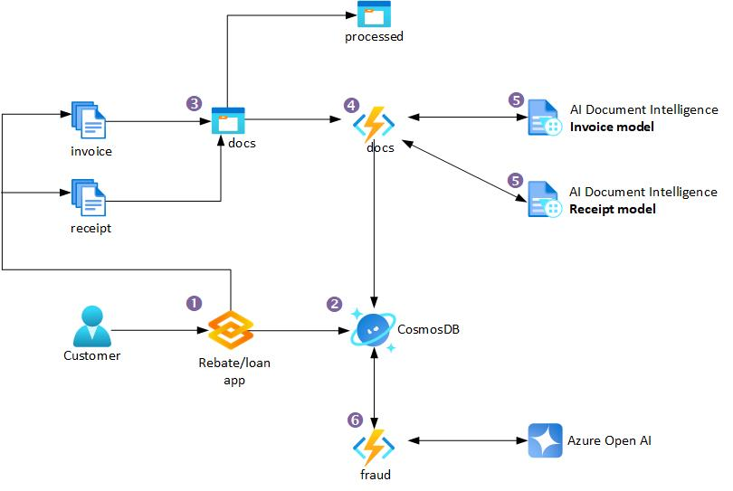

> I am a Microsoft employee, but the views expressed here are mine and not those of my employer.

I have been working with some clients recently on projects to automate the processing of financial documents. The goal is to extract key information from these documents and then use that information to perform some analysis. The analysis could be anything from fraud detection, risk assessment, summarization, classification, etc.

The idea behind this post is to show you how to build a simple document processing pipeline using Azure AI Document Intelligence and Azure Open AI. We will use Azure Document Intelligence to extract key information from the documents and then use Azure Open AI to perform fraud detection on the extracted information.

## TLDR

- Microsoft already has a defined architecture for automating document processing by using Azure AI Document Intelligence here - [Automate document processing by using Azure Form Recognizer](https://learn.microsoft.com/en-us/azure/architecture/ai-ml/architecture/automate-document-processing-azure-form-recognizer)
- Azure AI Document Intelligence is the new name for Azure Form Recognizer.
- Azure AI Document Intelligence is an AI service that applies advanced machine learning to extract text, key-value pairs, tables, and structures from documents automatically and accurately.
- I have created a working example of how to use Azure AI Document Intelligence, Azure Open AI, Azure Functions and Python to process financial documents here - [GitHub Repo]().

## Introduction

The sample I have created will focus on Extraction and Enrichment sections of the above diagram, centred around a financial company who needs to process online applications that have Invoices and Receipts as part of the application process. Please see my diagram below for a high-level overview of the process.

1. Customers use the financial company's application to apply for a rebate/loan. The application has been coded in Python with [Gradio]() to create a quick user interface.
2. The application form data is sent to Azure CosmosDB for storage.
3. The Invoice and Receipt are sent to separate containers in Azure Blob Storage.
4. An Azure Function is triggered by the new documents in the Blob Storage containers and sends the documents to Azure AI Document Intelligence for processing. There is a separate function for Invoices, that uses the pre-built Invoice model, and a separate function for Receipts, that uses the pre-built Receipt model.
5. Azure AI Document Intelligence process the Invoice and Receipt and sends the extracted information to Azure CosmosDB for storage.
6. An Azure Function is trigger and sends the Invoice and Receipt data to Azure Open AI for fraud detection. The results are sent to Azure CosmosDB for storage. The Invoice and Receipt documents are moved to a new container in Azure Blob Storage called `processed`.

## 1. Rebate/Loan Application

The application has been coded in Python with [Gradio]() to create a quick user interface. The application form data is sent to Azure CosmosDB for storage. The code for this can be found in this [GitHub Repo](dcs).

## 2. Azure CosmosDB

This is a vanilla Azure CosmosDB setup where I just accepted the defaults. I have created a database called `ToDoItems` and two containers called `Items` and `leases`.

> Side Note: I only used `ToDoItems` and `Items` and the database and container names because I was following a quick start guide. You should use more meaningful names for your project.

The `leases` container was created so I can use the [Change Feed Processor](https://docs.microsoft.com/en-us/azure/cosmos-db/change-feed-processor) to trigger the Azure Function when new documents are added to the Invoice and Receipt containers.

## 3. Azure Blob Storage

I have created three containers in Azure Blob Storage called `invoices`, `receipts` and `processed`. The Invoice and Receipt documents are sent to the `invoices` and `receipts` containers respectively. When Invoice and Receipt documents have been processed, they are moved to a new container in Azure Blob Storage called `processed`.

## 4. Azure Functions

I have created three Azure Functions, one for Invoices one for Receipts and one for fraud detection. The Invoice function is triggered by the new documents in the `invoices` container and the Receipt function is triggered by the new documents in the `receipts` container. The functions send the documents to Azure AI Document Intelligence for processing. The results are sent to Azure CosmosDB for storage.

The code for both of these functions can be found in this [GitHub Repo](dcs).

> Side Note: I used the FUnction v2 model for Python, which uses the new decorator model. I found it easier to use than the old model and loved having all three functions and there triggers in the same file.

## 5. Azure AI Document Intelligence

I am using the pre-built Invoice and Receipt models that are available in Azure AI Document Intelligence for this sample project, because they fit my needs. If you have other types of documents, you can create your own custom models.

There is a [great article here](https://learn.microsoft.com/en-us/azure/ai-services/document-intelligence/concept-custom?view=doc-intel-4.0.0) which takes you everything you need to know about customer models. There is an extract below;

`Custom models now include custom classification models for scenarios where you need to identify the document type prior to invoking the extraction model. Classifier models are available starting with the 2023-07-31 (GA) API. A classification model can be paired with a custom extraction model to analyze and extract fields from forms and documents specific to your business to create a document processing solution. Standalone custom extraction models can be combined to create composed models.`

In my example, the Azure functions Azure AI Document Intelligence receives an API call from the Azure Function and sends the document to the pre-built Invoice or Receipt model for processing. The results are sent to Azure CosmosDB for storage.

I also store the confidence score of the extraction in the CosmosDB. This is important because I want to know how confident the model is in the extraction. If the confidence score is low, I may want to send the document to a human for review.

> I also store the content JSON response from the Azure AI Document Intelligence API in the CosmosDB. This will be useful for the enrichment process :)

## 6. Azure Open AI

Now where does Azure Open AI come into this? Azure Open AI and generative AI can do many many things and there are many use cases for it within the financial industry. For my example, I chosen to create a fraud detection process.

Now this process is not designed to replace the human process, or the humans involved in fraud detection. It is design to make it easier for humans to do their job. I.e. flag certain applications as potentially fraudulent, record why Azure Open AI thinks it's fraudulent and then have a human review them.

I have created a separate Azure Function for fraud detection. This function is triggered when a CosmosDB record (an application) has had both their Invoice and Receipt processed by Azure AI Document Intelligence. The function then sends the Invoice and Receipt data to Azure Open AI for fraud detection. The results are sent to Azure CosmosDB for storage.

For example