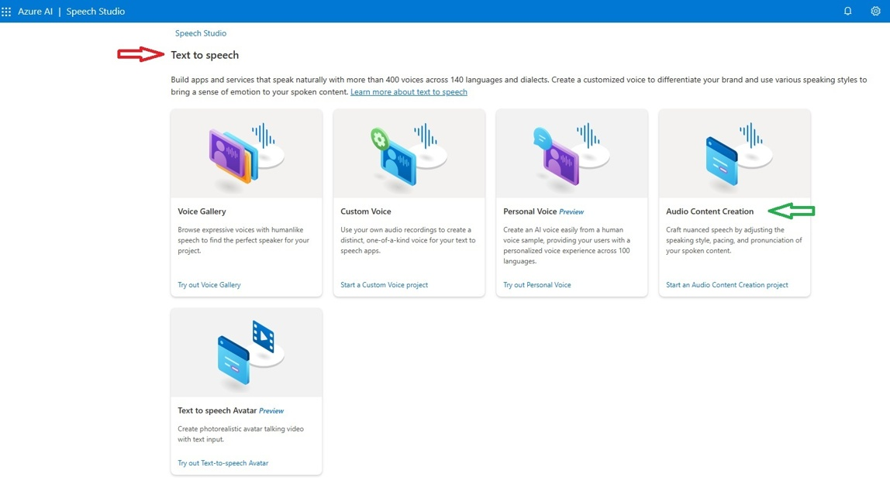
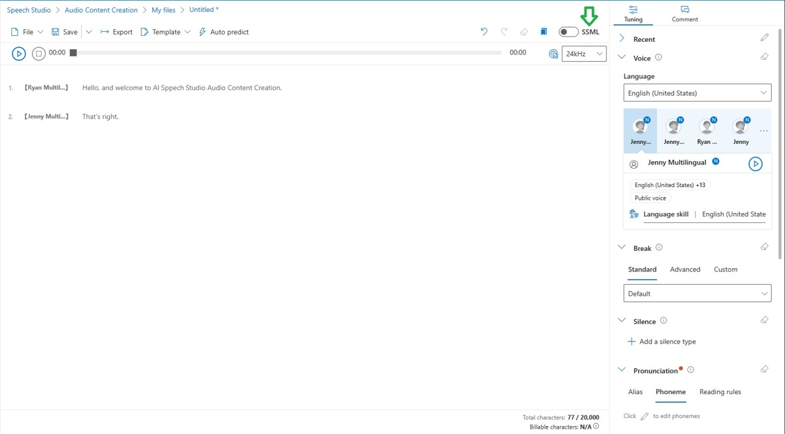
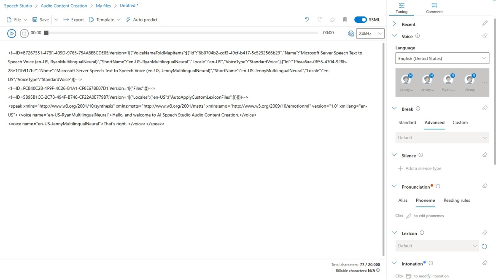

I have recently created a webpage that takes news articles from places like [Azure Feeds](https://azurefeeds.com/) and creates a daily summary of them using [Azure Open AI](https://azure.microsoft.com/en-us/products/ai-services/openai-service), which you can read about [here](https://fredderf204.github.io/mfblog4/p/ai-generated-azure-news-summary/). But I want to make these summaries multi-modal and have them read out to me, so I can listen to them on the go. So I thought I'd use [Azure AI Speech](https://azure.microsoft.com/en-us/services/cognitive-services/speech-services/) to convert the text to speech.

## TLDR

* What is Azure AI Speech service
* What is SSML
* How to use SSML with Azure AI Speech service
* Sample code

## What is Azure AI Speech service

[Azure AI Speech](https://azure.microsoft.com/en-us/services/cognitive-services/speech-services/) is a collection of speech-to-text and text-to-speech APIs that enables developers to add speech capabilities to their applications. It supports 125 languages and variants, and 60+ standard and custom voice fonts.

## What is SSML

[Speech Synthesis Markup Language (SSML)](https://www.w3.org/TR/speech-synthesis/) is an XML-based markup language that provides a standard way to mark up text for the generation of synthetic speech. SSML is a W3C specification that is supported by all major speech synthesis engines.

Microsoft has a great article [here](https://learn.microsoft.com/en-us/azure/ai-services/speech-service/speech-synthesis-markup) on SSML and it's primary use cases.

* Controlling pronunciation
* Choosing the voice
* Define the input text structure

Controlling the pronunciation can bee really useful if you work in a domain/industry that has a lot of acronyms or jargon. For example, I work in the IT industry and Microsoft, where there are a lot of acronyms. So I can use SSML to tell Azure AI Speech how to pronounce them correctly.

Choosing the voice is almost my favourite part. I love looking through the catalog of voices and choosing the one that I like the most. For the Azure AI Speech service, you can choose from 60+ standard and custom voice fonts. To find out what standard voices are available in your region, you can run the below command in your shell;

```bash

curl --location --request GET 'https://southeastasia.tts.speech.microsoft.com/cognitiveservices/voices/list' \
--header 'Ocp-Apim-Subscription-Key: xxxx-yyyy-zzzz' | jq '.[] | select(.Locale | contains ("en-NZ"))'

```

The above command sends a GET request to <https://southeastasia.tts.speech.microsoft.com/cognitiveservices/voices/list>, then pipes the output to jq, which is a lightweight and flexible command-line JSON processor. The jq command filters the output to only show the voices that are available in the en-NZ locale.

Please replace southeastasia with the region that you have deployed your Speech service to and replace the Ocp-Apim-Subscription-Key with your key. You can find your key in the Azure portal under your Speech service resource.

You can also change the locale to the one that you want to use and you will get a list of voices that are available for you to use.

> 💎 And what's even better, you can train a custom neural voice if you wish [https://learn.microsoft.com/en-us/azure/ai-services/speech-service/custom-neural-voice](https://learn.microsoft.com/en-us/azure/ai-services/speech-service/custom-neural-voice) or create a personal AI generated replication of your voice [https://learn.microsoft.com/en-us/azure/ai-services/speech-service/personal-voice-overview](https://learn.microsoft.com/en-us/azure/ai-services/speech-service/personal-voice-overview).

## How to use SSML with Azure AI Speech service

I am new to Azure AI Speech service and SSML. The best way I have found to interact with Azure AI Speech service is to use the [Speech Studio](https://speech.microsoft.com/). Once in there find the Text to speech section, then select Audio Content creation.



Next you can create a new file or folder. Click on new Text file.

Once in the editor you can enter your text and then select the voice that you want to use. At this point, if you don't want to use SSML you don't have to. You can just use the default experience and happily create an audio file from text. But if you want to use SSML, you can click on the SSML button and enter your SSML code.



Once you have entered your SSML code, you can click on the play button to hear what it sounds like. If you are happy with it, you can then click on the export button to download the audio file, plain text or the SSML code.



## Sample code

Now that I have some familiarity with Azure AI Speech service and SSML, I can now use it in my code. I have created a simple Python script that takes a string as input and converts it to an audio file using Azure AI Speech service. It then saves the audio into Azure BLOB storage as an MP3.

```python

import azure.cognitiveservices.speech as speechsdk
from azure.storage.blob import BlobServiceClient, BlobClient, ContainerClient, ContentSettings

# Connect to Azure BLOB storage
storageaccount = 'DefaultEndpointsProtocol=https;AccountName=aaa-bbb-ccc;AccountKey=xxx-yyy-zzz==;EndpointSuffix=core.windows.net'
blob_service_client = BlobServiceClient.from_connection_string(storageaccount)

# Creates an instance of a speech config with specified subscription key and service region.
speech_key, service_region = "ddd-eee-fff", "australiaeast"
speech_config = speechsdk.SpeechConfig(subscription=speech_key, region=service_region)

# Create ssml string
ssml_string = '''
<speak xmlns="http://www.w3.org/2001/10/synthesis" xmlns:mstts="http://www.w3.org/2001/mstts" xmlns:emo="http://www.w3.org/2009/10/emotionml" version="1.0" xml:lang="en-US"><voice name="en-US-GuyNeural"><s /><mstts:express-as style="newscast">
Hello and welcome to the daily AI Generated News Summary for Thursday 8th December 2024 . I'm your host Guy and here are today's headlines
</mstts:express-as><s /></voice>
<voice name="en-US-JennyNeural"><mstts:express-as style="newscast">
Thanks Guy. I'm Jenny and today we have a new article by azurefeeds entitled hello
</mstts:express-as></voice></speak>
'''

# Send string to Azure speech service
speech_synthesizer = speechsdk.SpeechSynthesizer(speech_config=speech_config, audio_config=None)
result = speech_synthesizer.speak_ssml(ssml_string)

# Get audio data
audio_data = result.audio_data

# Upload audio to Azure BLOB storage
mp3upload = blob_service_client.get_blob_client(container='20231211', blob=today + '.mp3')
mp3upload.upload_blob(audio_data, overwrite=True, content_settings=ContentSettings(content_type='audio/mpeg'))

```

> 💎 To test out this code, you can create the SSML in the Speech Studio and then copy and paste it the SSML into the ssml_string variable.

## How am I using this

I have added this process into my Azure Function that creates the daily summary of Azure news. As you can see above, I tried to make it sound like a News desk by having a host (Guy) and a presenter (Jenny). So in my code, I have Guy do a little intro, then I have Jenny read all of the articles, then I have Guy do a little outro. You can see my full code here: [https://github.com/fredderf204/ai-gen-news-summary/blob/main/html-email/__init__.py](https://github.com/fredderf204/ai-gen-news-summary/blob/main/html-email/__init__.py) and I have a put a snippet below;

```python

    blob_service_client = BlobServiceClient.from_connection_string(storageaccount)

    today = datetime.today().strftime('%Y%m%d')
    dow = datetime.now().strftime('%A')
    dateword = datetime.now().strftime('%B %d, %Y')
    container_client = blob_service_client.get_container_client(today)

    ssml_string = "<speak xmlns=\"http://www.w3.org/2001/10/synthesis\" xmlns:mstts=\"http://www.w3.org/2001/mstts\" xmlns:emo=\"http://www.w3.org/2009/10/emotionml\" version=\"1.0\" xml:lang=\"en-US\"><voice name=\"en-US-GuyNeural\"><s /><mstts:express-as style=\"newscast\">Hello and welcome to the daily AI Generated News Summary for " + dow + " " + dateword + ". I'm your host Guy</mstts:express-as><s /></voice><voice name=\"en-US-JennyNeural\"><mstts:express-as style=\"newscast\">And I'm Jenny. Here are your headlines for today."

    bloblist = container_client.list_blobs()

    for blob in bloblist:
        logging.info(blob.name)
        blob_client = container_client.get_blob_client(blob.name)
        downloader = blob_client.download_blob(max_concurrency=1, encoding='UTF-8')
        blob_text = downloader.readall()
        blob_text_json = json.loads(blob_text)
        ssml_string += "The next article is entitled " + blob_text_json.get('title') + " and was published on " + blob_text_json.get('author') + ". Here is the summary " + blob_text_json.get('summary')

    ssml_string += '</mstts:express-as><s /></voice><voice name="en-US-GuyNeural"><mstts:express-as style="newscast">Thanks Jenny. That\'s all from the news desk today. Thanks for listening and have a great day.</mstts:express-as></voice></speak>'

    speech_config = speechsdk.SpeechConfig(subscription=speech_key, region=service_region)
    speech_synthesizer = speechsdk.SpeechSynthesizer(speech_config=speech_config, audio_config=None)
    result = speech_synthesizer.speak_ssml(ssml_string)
    
    audio_data = result.audio_data

    mp3upload = blob_service_client.get_blob_client(container=today, blob=today + '.mp3')
    mp3upload.upload_blob(audio_data, overwrite=True, content_settings=ContentSettings(content_type='audio/mpeg'))

```

## Conclusion

I hope this article gives you to confidence and some ideas on how you can use SSML with Azure AI Speech service. I am really enjoying learning about Azure AI Speech service and SSML and I am looking forward to using it more in the future.

I hope you found this post useful. If you have any questions, feel free to reach out to me on [Twitter](https://twitter.com/fredderf204) or [Linkedin](https://www.linkedin.com/in/1michaelfriedrich/).
